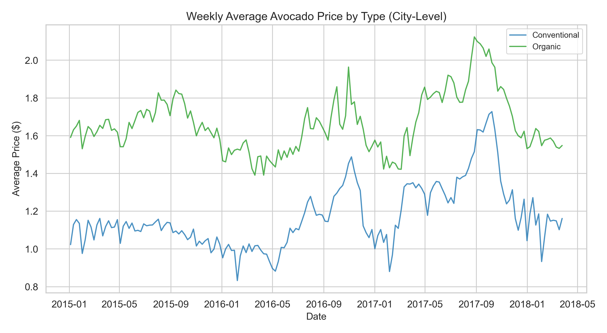
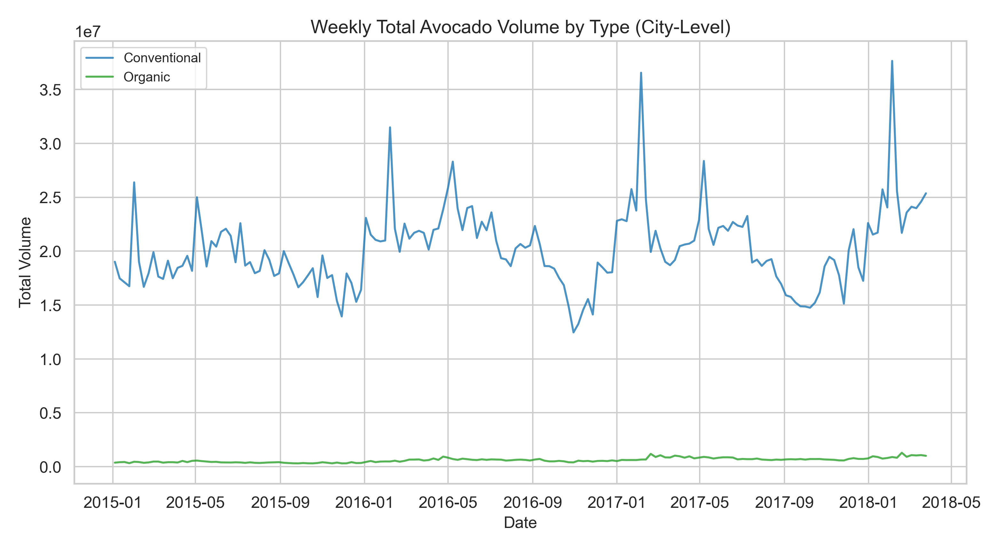
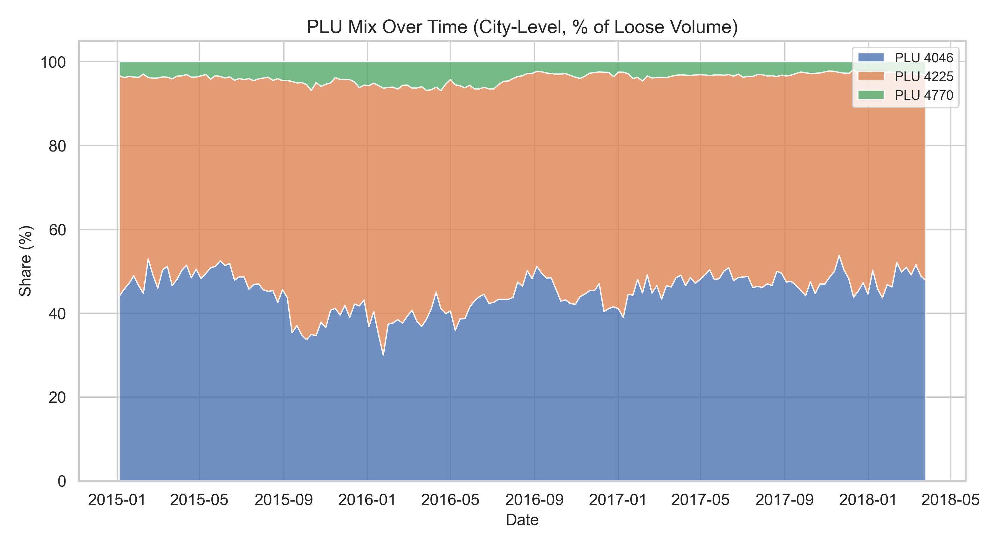
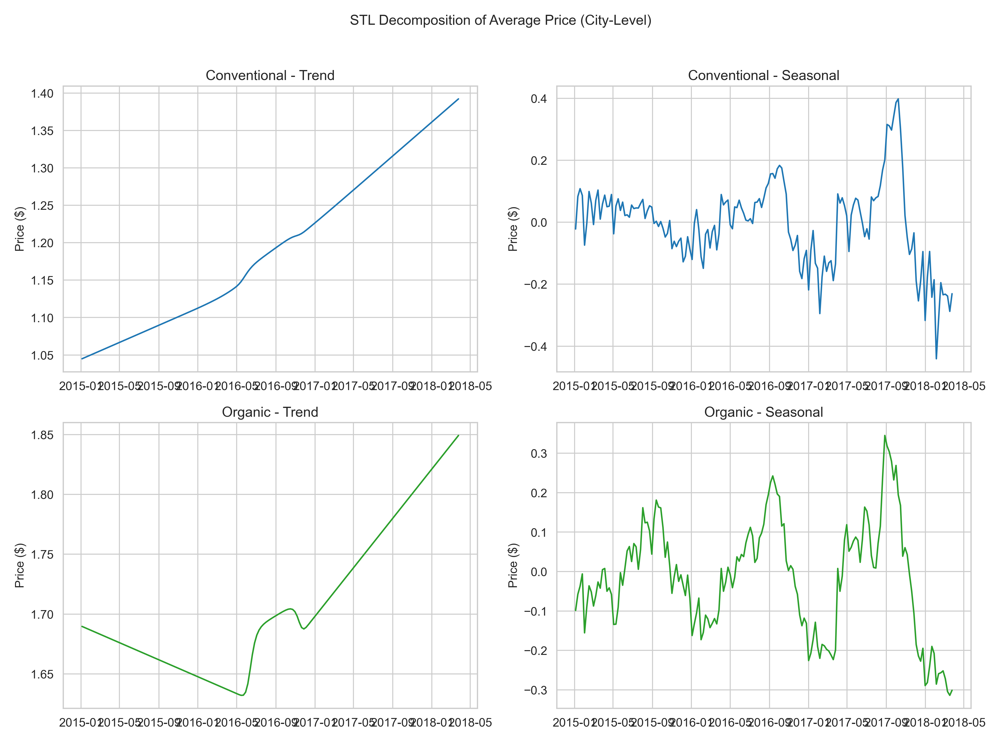
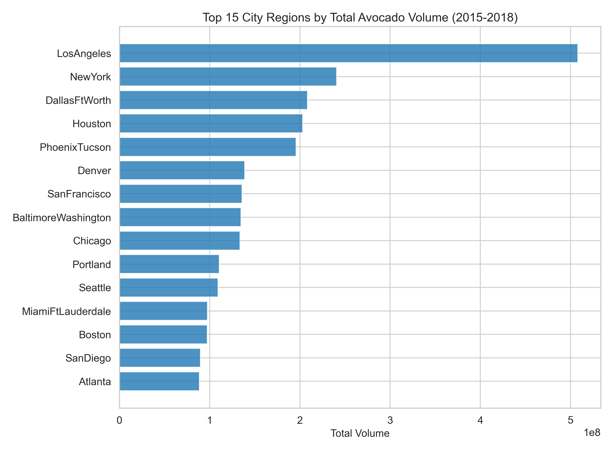
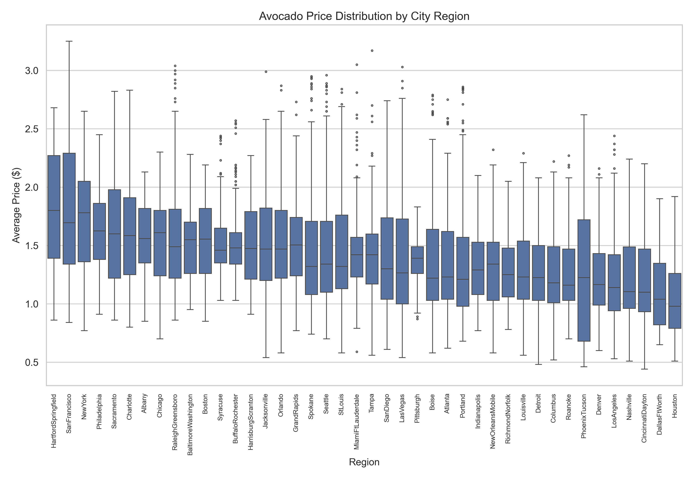
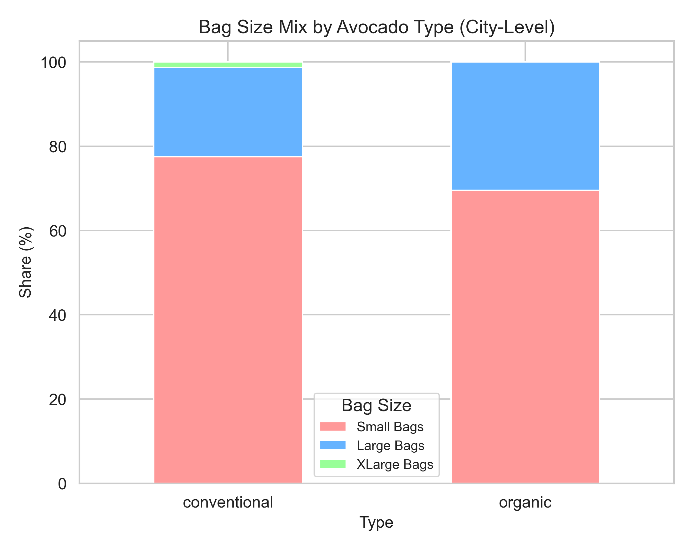
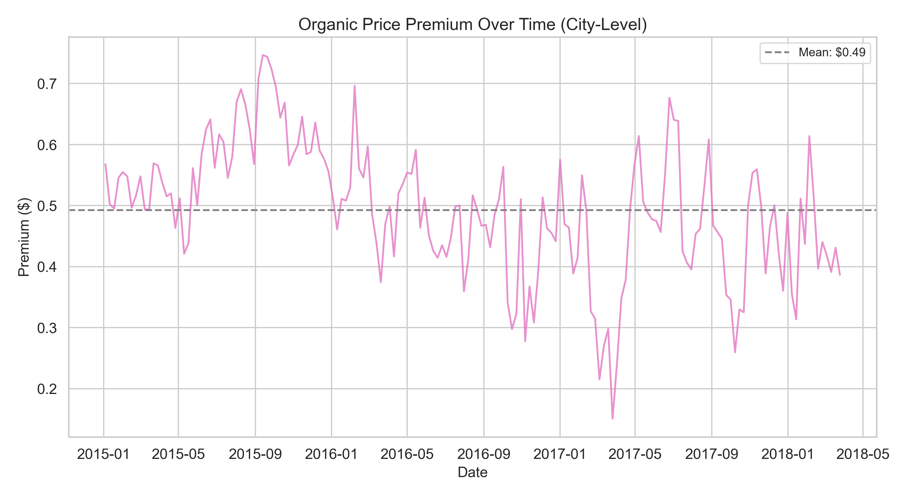

# Descriptive Analysis -- Avocado Sales
**Date:** 2026-05-25
**Data source:** data/processed/avocado_features.csv
**Regions analyzed:** city-level only (42 regions)
**Date range:** 2015-01-04 to 2018-03-25

## Key Findings

- Conventional avocados averaged $1.17 and organic $1.66 across all city-level regions, with both types peaking in 2017 (conventional +17.4% YoY, organic +10.7% YoY) before declining in early 2018 (avocado_features.csv, AveragePrice, region_level=="city").
- PLU 4225 and 4046 together account for 96.0% of loose avocado volume, with 4225 slightly dominant at 50.9% overall; PLU 4770 remains a niche product at 4.0% (avocado_features.csv, columns 4046/4225/4770, region_level=="city", 2015-2018).
- Price seasonality peaks in week 39 (late September) for conventional and week 37 (mid-September) for organic, while volume peaks in week 5 (early February) -- price and volume move inversely (STL decomposition, period=52, AveragePrice and Total Volume, region_level=="city").
- The organic premium has narrowed steadily from $0.58 in 2015 to $0.43 in 2018 (avocado_features.csv, mean AveragePrice where type=="organic" minus type=="conventional", grouped by year, region_level=="city").
- Los Angeles dominates volume at 507.9M units total -- more than double the next-largest market (New York at 240.7M) -- while Hartford-Springfield commands the highest average price at $1.82 (avocado_features.csv, Total Volume and AveragePrice, region_level=="city").

## 1. Price Trends

Average avocado prices across 42 city-level regions show a clear divergence between conventional and organic types, with a persistent premium for organic.

**National average price by type** (avocado_features.csv, mean of AveragePrice grouped by Date and type, region_level=="city", 2015-01-04 to 2018-03-25):
- Conventional: mean $1.17, range $0.83-$1.73
- Organic: mean $1.66, range $1.39-$2.12

**Year-over-year price change** (avocado_features.csv, mean AveragePrice grouped by year and type, region_level=="city"):

| Transition | Conventional | Organic |
|---|---|---|
| 2015 to 2016 | $1.09 to $1.12 (+2.0%) | $1.67 to $1.58 (-5.4%) |
| 2016 to 2017 | $1.12 to $1.31 (+17.4%) | $1.58 to $1.75 (+10.7%) |
| 2017 to 2018 | $1.31 to $1.14 (-13.0%) | $1.75 to $1.57 (-10.3%) |

Both types experienced a sharp price increase into 2017 followed by a decline in early 2018. The 2017 spike was proportionally larger for conventional avocados. This pattern warrants investigation by the diagnostic agent.

## 2. Volume Trends

Conventional avocados dominate total volume overwhelmingly, with organic representing only about 2.9% of city-level volume.

**Total volume by type** (avocado_features.csv, sum of Total Volume grouped by Date and type, region_level=="city", 2015-2018):
- Conventional: 3,414,201,660 total, ~20.2M weekly average
- Organic: 102,912,063 total, ~609K weekly average

**PLU code dominance** (avocado_features.csv, sum of columns 4046, 4225, 4770, region_level=="city", 2015-2018):
- PLU 4225: 50.9% of loose volume
- PLU 4046: 45.1% of loose volume
- PLU 4770: 4.0% of loose volume

**PLU mix shift by year** (avocado_features.csv, sum of 4046/4225/4770 grouped by year, region_level=="city"):

| Year | PLU 4046 | PLU 4225 | PLU 4770 |
|---|---|---|---|
| 2015 | 45.4% | 50.5% | 4.1% |
| 2016 | 41.9% | 53.2% | 4.9% |
| 2017 | 47.1% | 49.8% | 3.2% |
| 2018 | 48.5% | 48.7% | 2.8% |

The PLU mix shows 4046 gaining share from 2016 onward at the expense of 4225 and 4770. By 2018, the two dominant PLUs are nearly at parity.

## 3. Seasonality

STL decomposition (period=52, robust=True) was applied to nationally aggregated city-level weekly series for both AveragePrice and Total Volume, split by type.

**AveragePrice seasonality** (STL on mean AveragePrice across city-level regions, weekly frequency, 2015-2018):

| Metric | Conventional | Organic |
|---|---|---|
| Seasonal amplitude | $0.84 | $0.66 |
| Strength of seasonality | 0.623 | 0.673 |
| Peak week | 39 (late Sep) | 37 (mid-Sep) |
| Trough week | 5 (early Feb) | 5 (early Feb) |

**Total Volume seasonality** (STL on sum of Total Volume across city-level regions, weekly frequency, 2015-2018):

| Metric | Conventional | Organic |
|---|---|---|
| Seasonal amplitude | 22,803,101 | 672,365 |
| Strength of seasonality | 0.817 | 0.758 |
| Peak week | 5 (early Feb) | 7 (mid-Feb) |
| Trough week | 47 (late Nov) | 46 (mid-Nov) |

Prices peak in early fall (weeks 37-39) and trough in early winter (week 5), while volume exhibits the inverse pattern -- peaking in early February (likely Super Bowl demand) and troughing in late November. Volume seasonality is stronger (0.82 conventional) than price seasonality (0.62 conventional), suggesting volume is more predictably cyclical. Organic seasonality is slightly stronger for price but weaker for volume compared to conventional.

## 4. Regional Distribution

Regions were ranked by mean AveragePrice and total volume using city-level data only (region_level=="city").

**Top 5 regions by average price** (avocado_features.csv, mean of AveragePrice grouped by region, region_level=="city", 2015-2018):

| Region | Mean Price | Std Dev | Percentile |
|---|---|---|---|
| HartfordSpringfield | $1.82 | $0.47 | 100th |
| SanFrancisco | $1.80 | $0.57 | 98th |
| NewYork | $1.73 | $0.40 | 95th |
| Philadelphia | $1.63 | $0.32 | 93rd |
| Sacramento | $1.62 | $0.45 | 90th |

**Bottom 5 regions by average price** (same source and filters):

| Region | Mean Price | Std Dev | Percentile |
|---|---|---|---|
| LosAngeles | $1.22 | $0.38 | 12th |
| Nashville | $1.21 | $0.33 | 10th |
| CincinnatiDayton | $1.21 | $0.35 | 7th |
| DallasFtWorth | $1.09 | $0.30 | 5th |
| Houston | $1.05 | $0.30 | 2nd |

**Top 5 regions by total volume** (avocado_features.csv, sum of Total Volume grouped by region, region_level=="city", 2015-2018):

| Region | Total Volume | Weekly Avg |
|---|---|---|
| LosAngeles | 507,896,548 | 1,502,653 |
| NewYork | 240,734,128 | 712,231 |
| DallasFtWorth | 208,419,287 | 616,625 |
| Houston | 203,167,868 | 601,088 |
| PhoenixTucson | 195,643,312 | 578,826 |

**Bottom 5 regions by total volume** (same source and filters):

| Region | Total Volume | Weekly Avg |
|---|---|---|
| Louisville | 16,097,002 | 47,624 |
| Albany | 16,067,800 | 47,538 |
| Spokane | 15,565,275 | 46,051 |
| Boise | 14,413,188 | 42,643 |
| Syracuse | 10,942,668 | 32,375 |

An inverse relationship between price and volume is apparent at the regional level: the highest-volume markets (Los Angeles, Dallas-Fort Worth, Houston) tend to have the lowest average prices, while premium-priced markets (Hartford-Springfield, San Francisco) have lower volume. This pattern is consistent with basic supply-demand dynamics but warrants further diagnostic investigation.

## 5. Product Mix

**Bag size proportions** (avocado_features.csv, sum of Small Bags/Large Bags/XLarge Bags, region_level=="city", 2015-2018):

| Segment | Small Bags | Large Bags | XLarge Bags |
|---|---|---|---|
| National | 77.1% | 21.6% | 1.3% |
| Conventional | 77.5% | 21.2% | 1.3% |
| Organic | 69.5% | 30.4% | 0.0% |

Small bags dominate across both types. Organic avocados have a notably higher large-bag share (30.4% vs 21.2%) and virtually zero XLarge bag sales.

**Loose vs bagged ratio** (avocado_features.csv, sum of 4046+4225+4770 as "loose" vs Total Bags, grouped by Date, region_level=="city", 2015-2018):
- Average loose share: 71.1% of total volume is sold as individual loose avocados
- Remaining 28.9% is sold in bags

## 6. Organic Premium

The organic premium is defined as the difference between mean organic and mean conventional AveragePrice across all city-level regions for each week.

**National average organic premium:** $0.49 (avocado_features.csv, mean AveragePrice where type=="organic" minus mean AveragePrice where type=="conventional", grouped by Date, region_level=="city", 2015-2018).

**Premium range:** $0.15 to $0.75 per avocado.

**Premium trend by year** (same source, grouped by year):

| Year | Avg Premium |
|---|---|
| 2015 | $0.58 |
| 2016 | $0.47 |
| 2017 | $0.44 |
| 2018 | $0.43 |

The organic premium has declined 26% from $0.58 in 2015 to $0.43 in 2018. This narrowing could reflect increasing organic supply, shifting consumer price sensitivity, or retailer pricing strategies -- flagged for the diagnostic agent. The steepest drop occurred between 2015 and 2016 (-$0.11), after which the decline slowed.

