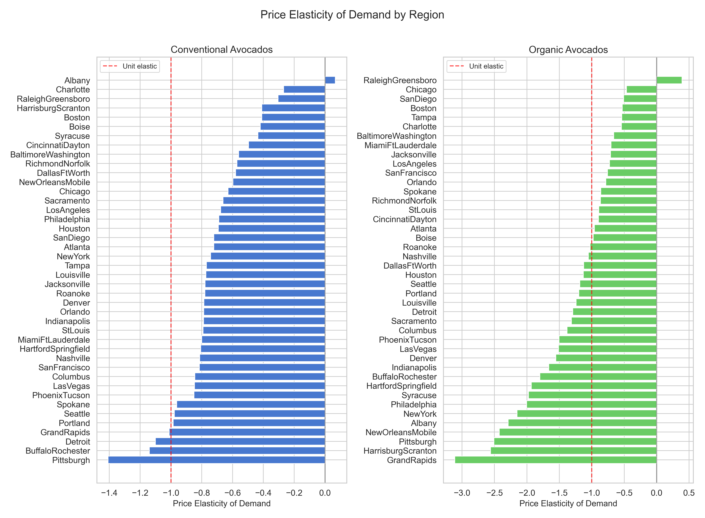
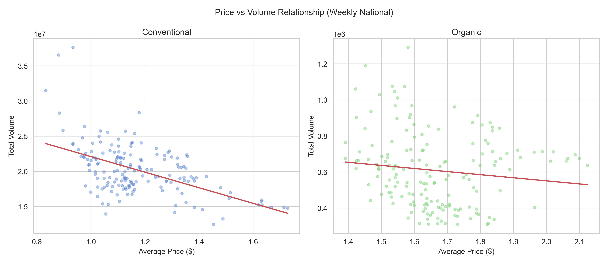
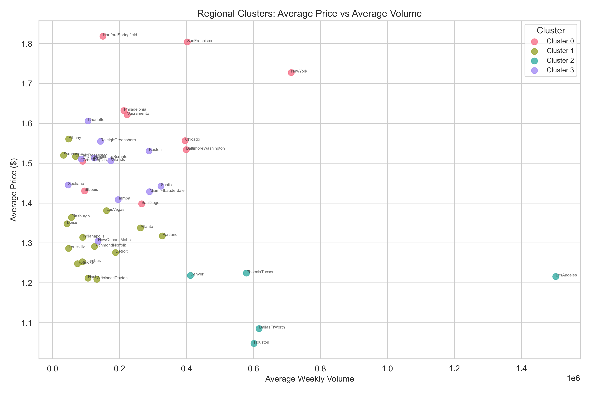
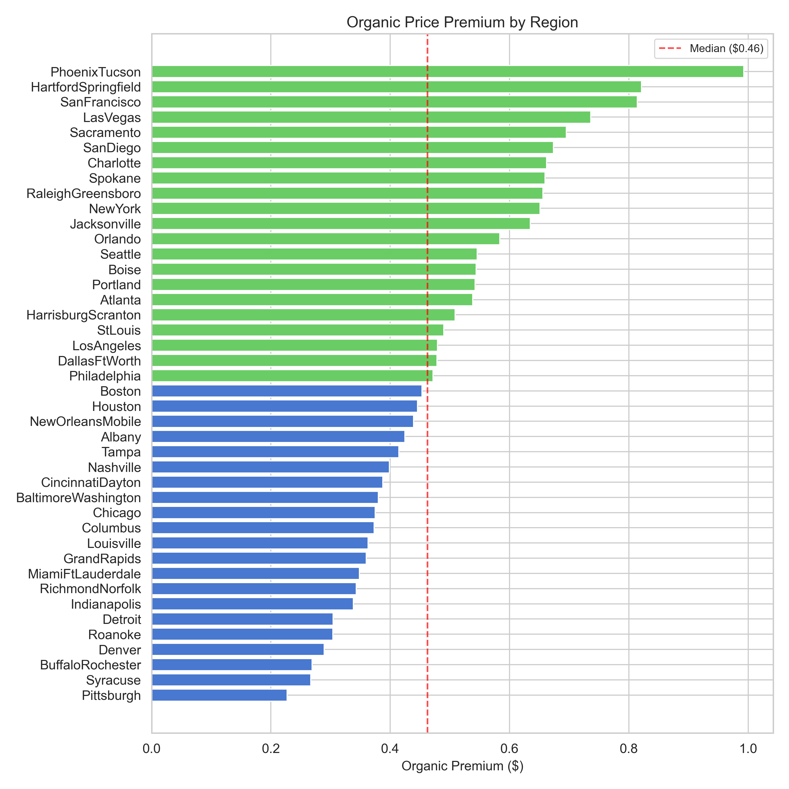
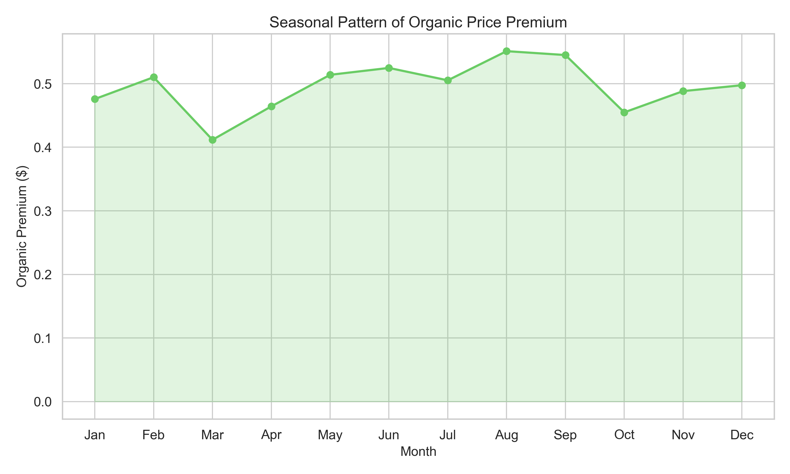
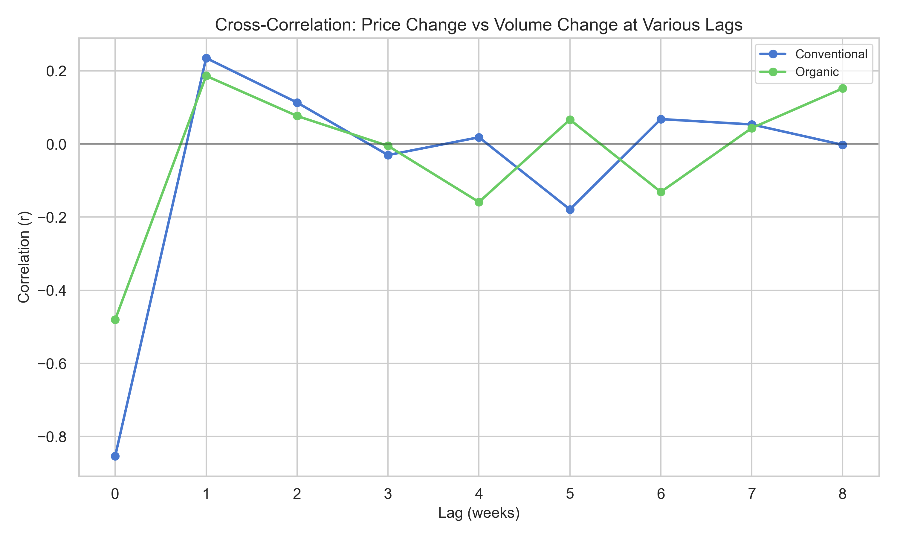

# Diagnostic Analysis -- Avocado Sales
**Date:** 2026-05-25
**Data source:** data/processed/avocado_features.csv
**Upstream dependency:** outputs/descriptive_report_2026-05-25.md
**Regions analyzed:** city-level only (42 regions, filtered by `region_level == "city"`)

## Key Findings

- Conventional avocado demand is **inelastic** (median elasticity -0.77), while organic demand is **elastic** (median -1.13), meaning organic consumers are substantially more price-sensitive. This difference is statistically significant across 41/42 and 39/42 regions respectively (log-log OLS on `AveragePrice` and `Total Volume`, `region_level == "city"`, p < 0.05).
- All five top price spike events are **associated with** simultaneous volume declines, consistent with supply-side shocks rather than demand-pull dynamics (weekly `pct_change` in mean `AveragePrice` vs sum `Total Volume`, `region_level == "city"`).
- The organic premium varies by a factor of 4.3x across regions -- from $0.23 in Pittsburgh to $0.99 in Phoenix/Tucson -- and has narrowed 25% from $0.58 (2015) to $0.43 (2018), suggesting increasing organic supply or competitive pricing pressure (mean `AveragePrice` by `type` and `region`, `region_level == "city"`).
- PLU 4046 exhibits dramatically higher price sensitivity (elasticity -2.88) than PLU 4225 (-0.28), indicating that these two dominant PLU codes serve fundamentally different market segments (log-log OLS on `AveragePrice` vs `4046`/`4225` columns, conventional type, `region_level == "city"`).
- Regional clustering reveals four distinct market archetypes: high-price/low-growth metros (Cluster 0), high-growth mid-tier cities (Cluster 1), high-volume/low-price mega-markets (Cluster 2), and moderate-growth Southern/coastal markets (Cluster 3).

## 1. Price-Volume Relationship

### Elasticity by Type

Log-log OLS regression of `Total Volume` on `AveragePrice` was computed for each (region, type) pair, filtering to `region_level == "city"` with a minimum of 30 observations per group (data source: `avocado_features.csv`).

| Metric | Conventional | Organic |
|---|---|---|
| Mean elasticity | -0.718 | -1.260 |
| Median elasticity | -0.771 | -1.128 |
| Range | [-1.41, +0.07] | [-3.11, +0.39] |
| Elastic regions (abs(e) > 1) | 4 / 42 | 24 / 42 |
| Significant at p < 0.05 | 41 / 42 | 39 / 42 |
| Positive sign (unexpected) | 1 / 42 (Albany) | 1 / 42 (Raleigh-Greensboro) |

Conventional avocado demand is predominantly inelastic: a 10% price increase is associated with roughly a 7.7% volume decline at the median. Organic demand is elastic at the median, with a 10% price increase associated with an 11.3% volume decline. This is consistent with organic avocados being perceived as a discretionary premium product where consumers can substitute to conventional.

**Most price-sensitive conventional markets:** Pittsburgh (-1.41), Buffalo-Rochester (-1.14), Detroit (-1.10), Grand Rapids (-1.01), Portland (-0.99).

**Least price-sensitive conventional markets:** Charlotte (-0.27), Raleigh-Greensboro (-0.30), Harrisburg-Scranton (-0.41), Boston (-0.41), Albany (+0.07, not significant p = 0.66).

**Most price-sensitive organic markets:** Grand Rapids (-3.11), Harrisburg-Scranton (-2.56), Pittsburgh (-2.51), New Orleans-Mobile (-2.43), Albany (-2.29).

**Least price-sensitive organic markets:** Chicago (-0.46), San Diego (-0.51), Boston (-0.53), Tampa (-0.54), Raleigh-Greensboro (+0.39, not significant p = 0.05).

**Caveat:** These elasticity estimates reflect observational correlation, not causal impact. Supply shifts, seasonality, and regional demographic factors confound the estimates. The R-squared values range from 0.001 to 0.59, indicating that price alone explains a modest-to-moderate share of volume variance.

## 2. Regional Drivers

K-means clustering (k=4, `random_state=42`, `n_init=10`) was applied to standardized features: average price, average volume, price growth (2015 to 2017), and volume growth (2015 to 2017), computed from `AveragePrice` and `Total Volume` columns in `avocado_features.csv`, filtered to `region_level == "city"`.

### Cluster Profiles

| Cluster | N | Avg Price | Avg Volume | Price Growth | Volume Growth | Description |
|---|---|---|---|---|---|---|
| 0 | 10 | $1.60 | 294,299 | +16.1% | -1.1% | **High-price, stagnant-volume metros** |
| 1 | 16 | $1.34 | 115,368 | +4.4% | +25.5% | **Growth markets** -- mid-tier cities with strong volume expansion |
| 2 | 5 | $1.16 | 742,029 | +11.7% | +9.3% | **Mega-markets** -- high volume, low price |
| 3 | 11 | $1.48 | 173,331 | +14.2% | +18.7% | **Moderate-growth Southern/coastal markets** |

**Cluster 0 (high-price metros):** Hartford-Springfield, San Francisco, New York, Philadelphia, Sacramento, Chicago, Baltimore-Washington, San Diego, Grand Rapids, St. Louis. These markets have high average prices but flat or declining volume growth from 2015-2017. They likely represent mature, saturated markets.

**Cluster 1 (growth markets):** 16 mid-tier cities including Nashville (+46.6% volume growth), Pittsburgh (+48.0%), Columbus (+28.0%), Buffalo-Rochester (+28.9%), and Syracuse (+33.9%). These are the fastest-growing avocado markets by volume, all with below-average prices. This cluster is driving national volume expansion.

**Cluster 2 (mega-markets):** Los Angeles, Dallas-Fort Worth, Houston, Phoenix-Tucson, Denver. These five markets average 742K units/week and have the lowest average price ($1.16). They are the price-setters for the national average due to sheer volume -- Los Angeles alone produces 1.5M units/week.

**Cluster 3 (moderate-growth Southern/coastal):** Boston, Miami-Fort Lauderdale, Seattle, Tampa, Orlando, Charlotte, Jacksonville, Raleigh-Greensboro, Spokane, New Orleans-Mobile, Harrisburg-Scranton. Balanced growth in both price and volume.

**Outliers:** Nashville and Pittsburgh (Cluster 1) were flagged as outliers, both showing volume growth above 45% -- far exceeding cluster peers. These markets may be experiencing a structural shift in avocado consumption.

## 3. Organic Premium Decomposition

The organic premium is computed as the difference between mean organic `AveragePrice` and mean conventional `AveragePrice` for each region, from `avocado_features.csv`, filtered to `region_level == "city"`.

### Regional Variation

The premium ranges from $0.23 (Pittsburgh) to $0.99 (Phoenix-Tucson), with a median of $0.48.

**Top 5 highest premium regions:**

| Region | Premium |
|---|---|
| PhoenixTucson | $0.99 |
| HartfordSpringfield | $0.82 |
| SanFrancisco | $0.81 |
| LasVegas | $0.74 |
| Sacramento | $0.70 |

**Bottom 5 lowest premium regions:**

| Region | Premium |
|---|---|
| Pittsburgh | $0.23 |
| Syracuse | $0.27 |
| BuffaloRochester | $0.27 |
| Denver | $0.29 |
| Roanoke | $0.30 |

Western and Northeastern metro areas tend to command higher organic premiums, while Rust Belt and smaller markets have compressed premiums. This pattern is consistent with regional differences in willingness to pay for organic products, though supply-side factors (proximity to organic growing regions) may also play a role.

### Seasonal Variation

The organic premium exhibits modest seasonality (mean `AveragePrice` by `type` and `month`, `region_level == "city"`):

- **Highest premium months:** August ($0.55) and September ($0.55)
- **Lowest premium month:** March ($0.41)
- **Amplitude:** $0.14 (roughly 28% of mean premium)

This seasonal pattern aligns with the descriptive report finding that price seasonality peaks in September. Organic prices may be more sensitive to late-summer supply constraints.

### Trend Over Time

The premium has declined steadily (mean `AveragePrice` difference by `year`, `region_level == "city"`):

| Year | Premium | YoY Change |
|---|---|---|
| 2015 | $0.58 | -- |
| 2016 | $0.47 | -$0.11 (-19.0%) |
| 2017 | $0.44 | -$0.03 (-6.4%) |
| 2018 | $0.43 | -$0.01 (-2.3%) |

The convergence is decelerating: the largest drop occurred in 2015-2016, and by 2017-2018 the premium has stabilized near $0.43. This is consistent with organic supply expansion reaching equilibrium, though continued monitoring is warranted.

### Premium Stability

The coefficient of variation (CV) of the weekly premium varies substantially by region. The five most variable markets -- Detroit (CV=1.19), Grand Rapids (CV=1.16), Denver (CV=1.06), Buffalo-Rochester (CV=1.02), Syracuse (CV=0.95) -- all have CVs above 0.95, meaning their premium fluctuates as much as its mean value. These are unreliable markets for organic pricing strategies.

## 4. Supply-Demand Dynamics

### Price-Volume Lag Correlation

Weekly percentage changes in national mean `AveragePrice` and sum `Total Volume` were cross-correlated at lags 0-8 weeks (data source: `avocado_features.csv`, `region_level == "city"`).

| Lag (weeks) | Conventional r | Organic r |
|---|---|---|
| 0 | **-0.854** | **-0.481** |
| 1 | +0.235 | +0.186 |
| 2 | +0.113 | +0.077 |
| 3 | -0.030 | -0.005 |
| 4 | +0.018 | -0.159 |

The dominant signal is a strong **contemporaneous** negative correlation: when prices change, volume moves in the opposite direction in the same week. The lag-1 reversal to positive suggests a partial rebound effect (volume recovers the following week after a price spike). There is no evidence of price changes predicting volume changes beyond 1-2 weeks.

Conventional avocados show a much stronger contemporaneous correlation (r = -0.85 vs -0.48), which is consistent with the inelastic-vs-elastic finding: while conventional demand is inelastic at the cross-sectional level, the time-series correlation is stronger because the price-volume link in conventional markets is dominated by supply-side variation (prices rise precisely when supply is scarce, mechanically reducing volume).

### Top 5 Price Spike Events

The five largest weekly price increases for conventional avocados (pct_change of mean `AveragePrice`, `region_level == "city"`):

| Date | Price Change | Volume Change | Likely Driver |
|---|---|---|---|
| 2017-02-19 | +16.2% | -19.6% | Supply-side |
| 2016-02-14 | +15.7% | -29.8% | Supply-side |
| 2018-02-11 | +13.8% | -32.1% | Supply-side |
| 2018-01-07 | +13.6% | -4.7% | Supply-side |
| 2018-02-18 | +11.5% | -15.2% | Supply-side |

All five spikes show price increases accompanied by volume decreases, consistent with supply contraction rather than demand surges. Notably, four of the five spikes occur in January-February, which aligns with the seasonal trough in Mexican avocado supply. The timing suggests these are recurring supply-driven seasonal shocks rather than idiosyncratic events.

**Overall price-volume correlation** (levels, not changes): r = -0.52 for conventional, r = -0.13 for organic (weekly national aggregates).

## 5. PLU and Bag Size Drivers

### PLU Price Sensitivity

Log-log OLS regression of each PLU volume column on `AveragePrice` for conventional avocados (`region_level == "city"`, observations where PLU volume > 0):

| PLU | Elasticity | R-squared | p-value | n |
|---|---|---|---|---|
| 4046 | **-2.882** | 0.144 | < 0.001 | 7,098 |
| 4225 | **-0.277** | 0.003 | < 0.001 | 7,098 |
| 4770 | **-2.405** | 0.057 | < 0.001 | 7,097 |

PLU 4046 (Hass small) and 4770 (Hass large) are highly price-elastic, while PLU 4225 (Hass medium/large) is extremely inelastic. This divergence suggests PLU 4225 serves a more stable, price-insensitive demand base, while 4046 and 4770 volumes fluctuate substantially with price. The low R-squared values indicate that price is only one of many drivers.

### PLU Mix Shifts and Price

The correlation between PLU share and `AveragePrice` (conventional, `region_level == "city"`):
- PLU 4046 share vs price: r = -0.325 (negative -- when prices are high, 4046 share drops)
- PLU 4225 share vs price: r = +0.317 (positive -- when prices are high, 4225 share rises)
- PLU 4770 share vs price: r = -0.002 (no relationship)

This pattern suggests a **substitution effect**: when prices rise, consumers shift toward PLU 4225 (the more price-inelastic variety) and away from PLU 4046. The year-over-year PLU mix shift identified in the descriptive report (4046 gaining share from 2016 onward) is therefore more consistent with preference-driven or supply-driven change than price-driven substitution, since 4046 gained share during 2017 when prices were highest.

### Bag Size Trends

Small bag share has declined steadily from 83.0% to 72.3% (conventional, 2015-2018), while large bag share grew from 16.0% to 26.0% (mean `small_bag_pct` and `large_bag_pct` by year, conventional type, `region_level == "city"`). This shift toward larger bags could reflect changing household sizes, bulk-buying behavior, or retailer merchandising strategy.

For organic, the pattern is non-monotonic: small bag share dropped from 72.4% (2015) to 65.8% (2016), then reversed to 81.5% by 2018. This irregularity suggests the organic bag mix is driven by supply/retailer decisions rather than stable consumer preference.

The loose-to-bagged ratio shows no meaningful correlation with price for conventional (r = 0.0004), suggesting the loose/bag split is independent of price dynamics.

## Hypotheses for Predictive Agent

Based on the diagnostic analysis, the following patterns appear stable and forecastable:

### Forecastable Patterns

1. **Seasonal supply shocks in January-February** produce predictable price spikes. The timing is consistent across all three years analyzed (2016, 2017, 2018). A seasonal component or Fourier features at the weekly level should capture this.

2. **Price-volume inverse relationship** is strong and contemporaneous (r = -0.85 for conventional). Lagged price should be a weak but useful predictor of next-week volume (lag-1 r = +0.24, indicating partial recovery).

3. **Organic premium convergence** has decelerated and may be approaching a floor near $0.43. A trend feature on the premium should help model organic prices relative to conventional.

4. **Regional cluster membership** is structurally stable. Cluster 1 (growth markets) should be modeled with a positive volume trend, while Cluster 0 (mature metros) should use a flat or declining trend.

5. **PLU 4225 stability.** PLU 4225 volume is nearly price-insensitive (elasticity -0.28) and can serve as a stable baseline in volume forecasts.

### Recommended Features for Predictive Models

- **Temporal:** week_of_year (Fourier-encoded), month, quarter, year (trend), holiday flags (Super Bowl week ~5, Cinco de Mayo ~18-19)
- **Price features:** lagged price (1-4 weeks), rolling 4-week price mean, price_yoy_lag, price percentile within region
- **Volume features:** lagged volume (1-4 weeks), rolling 4-week volume mean, volume_yoy_change
- **Product mix:** plu_4046_share, plu_4225_share, small_bag_pct, large_bag_pct, loose_share
- **Regional:** cluster assignment (as categorical), region-level mean price and volume (as fixed effects or embeddings)
- **Type interaction:** organic_premium (lagged), type indicator, type x season interaction
- **Supply proxy:** national total volume lagged 1 week (supply-side indicator)

### Recommended Model Strategy

- Start with a linear model (Ridge/Lasso) using the features above as a baseline.
- Evaluate tree-based models (LightGBM, XGBoost) for capturing nonlinear PLU substitution and regional heterogeneity.
- Use time-based cross-validation with an expanding or sliding window -- no random splits, as the data has strong temporal structure.
- Model conventional and organic separately, given the different elasticity regimes.
- Consider hierarchical forecasting: model national trend first, then region-level residuals.
