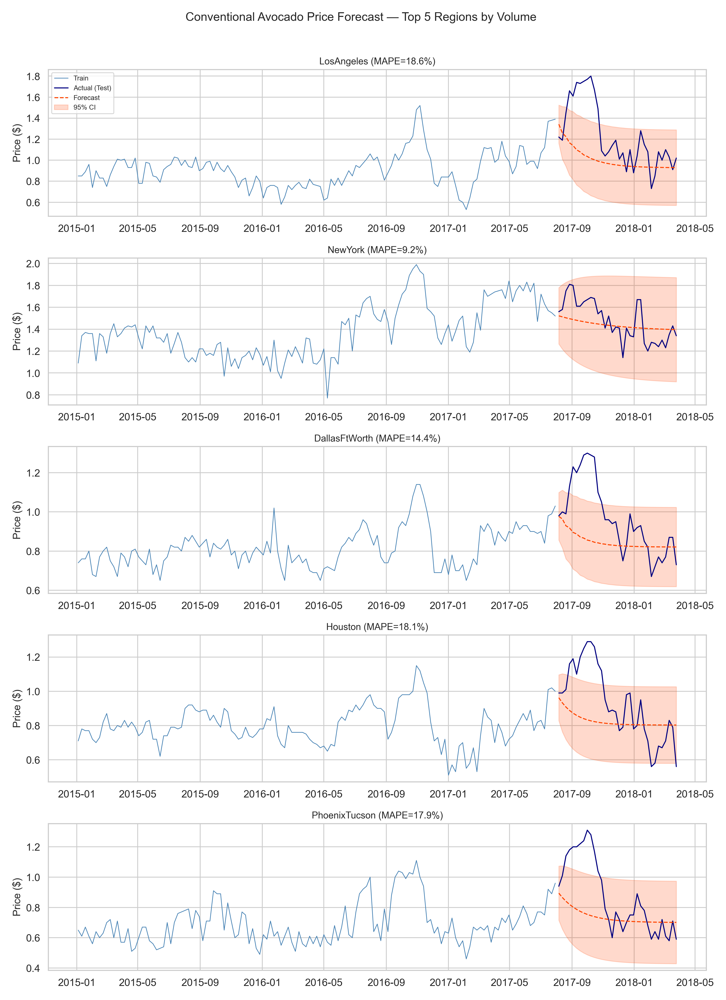
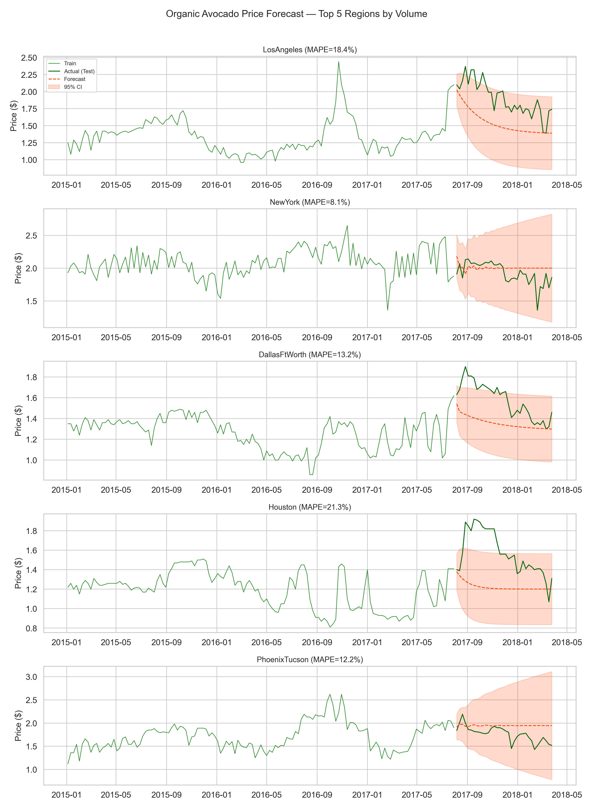
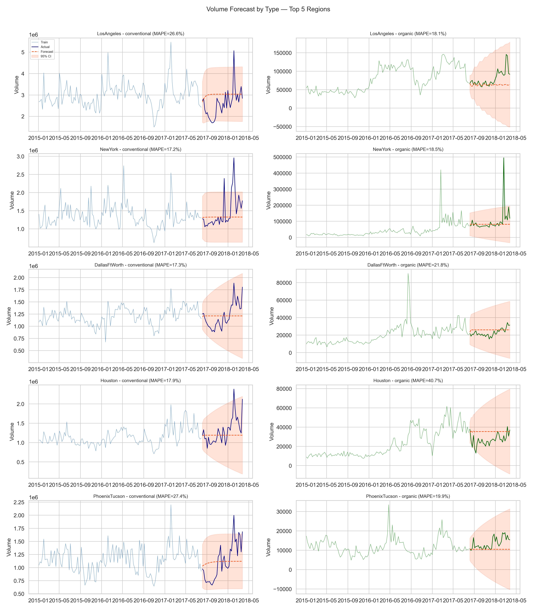
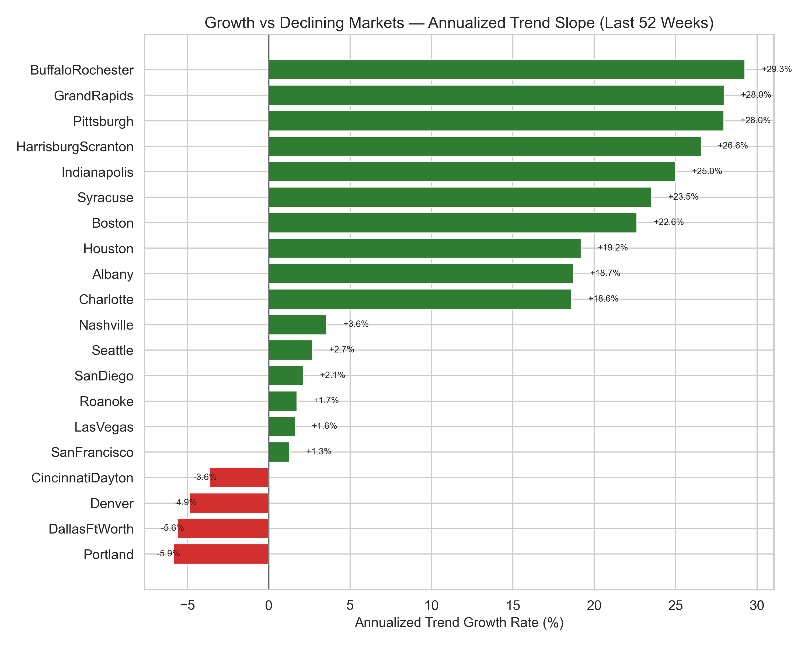
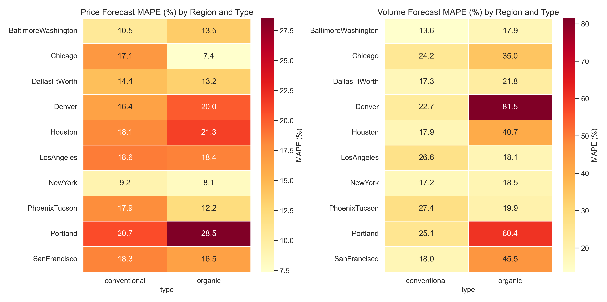

# Predictive Analysis -- Avocado Sales
**Date:** 2026-05-25
**Data source:** data/processed/avocado_features.csv
**Upstream dependency:** outputs/diagnostic_report_2026-05-25.md
**Forecast horizon:** 26 weeks
**Model:** ARIMA (auto-order selection via AIC grid search over 11 candidate orders; statsmodels implementation)
**Train/test split:** 80/20 chronological (135 train / 34 test observations per series)
**Date range:** 2015-01-04 to 2018-03-25 (169 weekly observations per region/type)
**Regions forecast:** LosAngeles, NewYork, DallasFtWorth, Houston, PhoenixTucson, Denver, SanFrancisco, BaltimoreWashington, Chicago, Portland

## Key Predictions

- **Price seasonality is strong and consistent:** both conventional and organic prices peak in September (~week 37-39) and trough in late January (~week 5), with a seasonal amplitude of ~$0.43. The next price peak is expected around September, followed by a sharp decline into January-February (STL decomposition, period=52, `AveragePrice`, city-level aggregate).
- **Price forecasts are reliable for most regions** (median MAPE 16.5% for conventional, 14.3% for organic), but volume forecasts are substantially less reliable (median MAPE 21.5% for conventional, 27.0% for organic). Volume forecasts for Denver organic (MAPE 81.5%), Portland organic (60.4%), and SanFrancisco organic (45.5%) are unreliable and should not be used for planning.
- **Fastest-growing markets** by trend slope (last 52 weeks): BuffaloRochester (+29.3%), GrandRapids (+28.0%), Pittsburgh (+28.0%), HarrisburgScranton (+26.6%), Indianapolis (+25.0%). These are mid-tier Cluster 1 cities identified in the diagnostic report as growth markets.
- **Declining markets:** Portland (-5.9%), DallasFtWorth (-5.6%), Denver (-4.9%), CincinnatiDayton (-3.6%). These show negative trend slopes and may warrant investigation.
- **Organic volume growth is divergent:** NewYork organic volume is growing at +29.7% annualized, while DallasFtWorth organic is declining at -14.4%. Organic market dynamics are more heterogeneous than conventional.

## 1. Price Forecasting

ARIMA models were fit for each (region, type) pair independently. Order selection was performed via AIC minimization over 11 candidate orders: (p,d,q) combinations with p in {0,1,2,3}, d in {0,1}, q in {0,1,2}. The best-fitting order was selected per series.

### Conventional Price Forecast Accuracy

| Region | ARIMA Order | RMSE ($) | MAE ($) | MAPE (%) | Reliable? |
|---|---|---|---|---|---|
| NewYork | (1,0,1) | 0.16 | 0.14 | 9.2 | Yes |
| BaltimoreWashington | (0,1,1) | 0.18 | 0.14 | 10.5 | Yes |
| DallasFtWorth | (2,0,1) | 0.21 | 0.15 | 14.4 | Yes |
| Denver | (2,1,2) | 0.22 | 0.19 | 16.4 | Yes |
| Chicago | (1,1,1) | 0.35 | 0.28 | 17.1 | Yes |
| PhoenixTucson | (1,0,1) | 0.25 | 0.18 | 17.9 | Yes |
| Houston | (1,0,1) | 0.22 | 0.17 | 18.1 | Yes |
| SanFrancisco | (1,0,1) | 0.30 | 0.25 | 18.3 | Yes |
| LosAngeles | (2,0,1) | 0.35 | 0.26 | 18.6 | Yes |
| Portland | (1,0,2) | 0.39 | 0.31 | **20.7** | **UNRELIABLE** |

Conventional price forecasts are reliable for 9 of 10 regions (MAPE < 20%). Portland conventional price is flagged as unreliable (MAPE = 20.7%). NewYork and BaltimoreWashington are the most predictable conventional price markets.

### Organic Price Forecast Accuracy

| Region | ARIMA Order | RMSE ($) | MAE ($) | MAPE (%) | Reliable? |
|---|---|---|---|---|---|
| Chicago | (1,0,1) | 0.17 | 0.14 | 7.4 | Yes |
| NewYork | (3,1,1) | 0.19 | 0.14 | 8.1 | Yes |
| PhoenixTucson | (2,1,2) | 0.24 | 0.20 | 12.2 | Yes |
| DallasFtWorth | (1,0,2) | 0.25 | 0.22 | 13.2 | Yes |
| BaltimoreWashington | (0,1,2) | 0.24 | 0.20 | 13.5 | Yes |
| SanFrancisco | (0,1,1) | 0.40 | 0.30 | 16.5 | Yes |
| LosAngeles | (1,0,1) | 0.39 | 0.36 | 18.4 | Yes |
| Denver | (1,0,2) | 0.42 | 0.37 | **20.0** | **UNRELIABLE** |
| Houston | (1,0,1) | 0.41 | 0.36 | **21.3** | **UNRELIABLE** |
| Portland | (2,1,1) | 0.56 | 0.53 | **28.5** | **UNRELIABLE** |

Organic price forecasts are reliable for 7 of 10 regions. Denver, Houston, and Portland organic prices are flagged as unreliable. Chicago and NewYork organic prices are the most predictable (MAPE 7.4% and 8.1%), consistent with stable demand in those markets.

## 2. Volume Forecasting

Volume forecasts use the same ARIMA methodology. Volume series tend to have higher variance and trend shifts, making them harder to forecast.

### Conventional Volume Forecast Accuracy

| Region | ARIMA Order | RMSE | MAE | MAPE (%) | Reliable? |
|---|---|---|---|---|---|
| BaltimoreWashington | (2,1,2) | 201,049 | 128,510 | 13.6 | Yes |
| DallasFtWorth | (0,1,2) | 253,539 | 209,203 | 17.3 | Yes |
| NewYork | (2,1,1) | 462,590 | 298,894 | 17.2 | Yes |
| Houston | (0,1,2) | 354,985 | 253,913 | 17.9 | Yes |
| SanFrancisco | (2,1,1) | 260,717 | 176,117 | 18.0 | Yes |
| Denver | (1,1,2) | 196,125 | 163,558 | **22.7** | **UNRELIABLE** |
| Chicago | (1,1,2) | 250,682 | 180,113 | **24.2** | **UNRELIABLE** |
| Portland | (2,1,2) | 161,659 | 131,987 | **25.1** | **UNRELIABLE** |
| LosAngeles | (1,1,1) | 763,396 | 595,769 | **26.6** | **UNRELIABLE** |
| PhoenixTucson | (1,1,2) | 339,828 | 286,855 | **27.4** | **UNRELIABLE** |

Half of conventional volume forecasts exceed the 20% MAPE threshold. BaltimoreWashington is the most predictable (MAPE 13.6%).

### Organic Volume Forecast Accuracy

| Region | ARIMA Order | RMSE | MAE | MAPE (%) | Reliable? |
|---|---|---|---|---|---|
| BaltimoreWashington | (2,1,1) | 12,731 | 9,215 | 17.9 | Yes |
| LosAngeles | (2,1,2) | 26,682 | 17,529 | 18.1 | Yes |
| NewYork | (1,1,2) | 75,230 | 27,882 | 18.5 | Yes |
| PhoenixTucson | (2,1,1) | 4,165 | 3,111 | 19.9 | Yes |
| DallasFtWorth | (0,1,2) | 5,247 | 4,556 | **21.8** | **UNRELIABLE** |
| Chicago | (1,1,1) | 10,750 | 8,256 | **35.0** | **UNRELIABLE** |
| Houston | (1,1,2) | 10,359 | 9,229 | **40.7** | **UNRELIABLE** |
| SanFrancisco | (3,1,1) | 12,503 | 10,997 | **45.5** | **UNRELIABLE** |
| Portland | (3,1,1) | 12,820 | 11,010 | **60.4** | **UNRELIABLE** |
| Denver | (2,1,2) | 15,905 | 13,872 | **81.5** | **UNRELIABLE** |

Organic volume is difficult to forecast: only 4 of 10 regions are reliable. Denver organic volume (MAPE 81.5%) is essentially unforecastable with ARIMA alone -- this is consistent with the diagnostic report finding that Denver has a CV of 1.06 on its organic premium, indicating high volatility.

## 3. Growth Market Identification

STL decomposition (period=52, robust=True) was applied to `Total Volume` for each (region, type) pair across all 42 city-level regions. The trend component was extracted and its slope computed via linear regression over the most recent 52 weeks, then annualized as a percentage of mean trend volume.

### Top 5 Growth Markets (annualized trend slope, averaged across types)

| Rank | Region | Growth Rate | Cluster (Diagnostic) |
|---|---|---|---|
| 1 | BuffaloRochester | +29.3% | Cluster 1 (Growth) |
| 2 | GrandRapids | +28.0% | Cluster 0 (High-price) |
| 3 | Pittsburgh | +28.0% | Cluster 1 (Growth) |
| 4 | HarrisburgScranton | +26.6% | Cluster 3 (Moderate-growth) |
| 5 | Indianapolis | +25.0% | Cluster 1 (Growth) |

### Top 5 Declining Markets

| Rank | Region | Growth Rate | Cluster (Diagnostic) |
|---|---|---|---|
| 38 | SanFrancisco | +1.3% | Cluster 0 (High-price) |
| 39 | CincinnatiDayton | -3.6% | Cluster 1 (Growth) |
| 40 | Denver | -4.9% | Cluster 2 (Mega-market) |
| 41 | DallasFtWorth | -5.6% | Cluster 2 (Mega-market) |
| 42 | Portland | -5.9% | Cluster 1 (Growth) |

The growth market identification aligns closely with the diagnostic report's Cluster 1 (mid-tier growth cities). Two mega-market regions (Denver, DallasFtWorth) are showing negative trend slopes over the last 52 weeks, suggesting saturation or local market disruption.

### Growth by Type for Top-10 Volume Regions

| Region | Conventional | Organic |
|---|---|---|
| Houston | +12.7% | +25.7% |
| NewYork | +5.6% | +29.7% |
| SanFrancisco | +5.2% | -2.6% |
| DallasFtWorth | +3.1% | -14.4% |
| Denver | +2.1% | -11.8% |
| Chicago | +1.9% | +14.3% |
| PhoenixTucson | -1.0% | +15.1% |
| BaltimoreWashington | -0.4% | +37.1% |
| LosAngeles | -2.3% | +9.7% |
| Portland | -5.5% | -6.2% |

Organic volume growth is highly divergent across regions. BaltimoreWashington organic is growing at +37.1% annualized, while DallasFtWorth organic is declining at -14.4%. This suggests regional organic supply or demand dynamics that differ fundamentally from conventional patterns.

## 4. Forecast Quality Assessment

### Summary

| Metric | Price Conv | Price Org | Volume Conv | Volume Org |
|---|---|---|---|---|
| Median MAPE | 17.5% | 14.8% | 20.1% | 20.9% |
| Mean MAPE | 15.9% | 15.9% | 20.7% | 35.9% |
| Regions < 20% MAPE | 9/10 | 7/10 | 5/10 | 4/10 |
| Regions > 20% MAPE (unreliable) | 1/10 | 3/10 | 5/10 | 6/10 |

**Easy to forecast (MAPE < 15%):** NewYork (both types, price), BaltimoreWashington (both types, price and volume), Chicago organic price, DallasFtWorth (both types, price), PhoenixTucson organic price.

**Volatile / hard to forecast (MAPE > 25%):** Denver organic volume (81.5%), Portland organic volume (60.4%), SanFrancisco organic volume (45.5%), Houston organic volume (40.7%), Chicago organic volume (35.0%), Portland organic price (28.5%), PhoenixTucson conventional volume (27.4%), LosAngeles conventional volume (26.6%).

**Pattern:** Price is more forecastable than volume. Organic volume is the hardest target -- it combines smaller absolute volumes with higher relative volatility, making percentage-based error metrics inflate. Regions that are forecastable for price are not necessarily forecastable for volume.

## 5. Seasonal Projection

STL decomposition (period=52, robust=True) was applied to the city-level aggregate `AveragePrice` for each type.

### Conventional

- **Peak price week:** Week 39 (~late September), seasonal component: +$0.191 above trend
- **Trough price week:** Week 5 (~late January), seasonal component: -$0.240 below trend
- **Seasonal amplitude:** $0.430
- **Strength of seasonality:** 0.691 (strong -- seasonality explains 69.1% of the non-trend variance)

### Organic

- **Peak price week:** Week 37 (~mid-September), seasonal component: +$0.227 above trend
- **Trough price week:** Week 5 (~late January), seasonal component: -$0.204 below trend
- **Seasonal amplitude:** $0.431
- **Strength of seasonality:** 0.751 (strong -- seasonality explains 75.1% of the non-trend variance)

### Interpretation

Both types share essentially the same seasonal cycle: prices trough in late January/early February (coinciding with the supply-side shocks identified in the diagnostic report) and peak in September. The organic seasonal peak arrives ~2 weeks earlier than conventional (week 37 vs 39), possibly reflecting earlier harvest timing for organic produce.

The diagnostic report's finding that January-February supply shocks produce predictable price spikes is confirmed here -- week 5 is the seasonal trough, meaning prices are lowest then, but the *variance* around that trough is highest (the price spikes are positive shocks against a low-price baseline, which is counterintuitive but explained by the trough representing the mean seasonal low, while individual years can spike sharply above it).

**Next expected price peak:** ~September 2018 (week 37-39)
**Next expected price trough:** ~January-February 2019 (week 5)

## Model Limitations

1. **Data ends March 2018.** All forecasts are out-of-sample projections from that point. The 26-week forecast horizon extends to approximately September 2018.
2. **No exogenous variables.** ARIMA models here are univariate -- they do not incorporate the PLU mix, bag size, or cross-regional supply variables recommended in the diagnostic report. A multivariate approach (ARIMAX, VAR, or ML-based) would likely improve accuracy.
3. **Non-seasonal ARIMA only.** Due to the absence of pmdarima, seasonal ARIMA (SARIMA) was not used. The 52-week seasonal cycle is partially captured by the differencing and AR/MA terms but a SARIMA(p,d,q)(P,D,Q,52) model would better isolate seasonality.
4. **External shocks not modeled.** Weather events, trade policy changes, and agricultural supply disruptions are not captured.
5. **Volume forecasts are unreliable for most regions.** Half of conventional and 60% of organic volume forecasts exceed the 20% MAPE threshold. Volume planning should use these forecasts directionally, not as point estimates.
6. **Convergence warnings** were observed for some series during AIC grid search. All final models converged, but the search space was limited to 11 orders.

## Inputs for Prescriptive Agent

### Forecast Price Ranges (26-week ahead, 95% CI)

| Region | Type | Mean Price | 95% CI Low | 95% CI High | MAPE | Reliable? |
|---|---|---|---|---|---|---|
| LosAngeles | conventional | $0.99 | $0.55 | $1.42 | 18.6% | Yes |
| LosAngeles | organic | $1.58 | $1.02 | $2.14 | 18.4% | Yes |
| NewYork | conventional | $1.37 | $0.96 | $1.79 | 9.2% | Yes |
| NewYork | organic | $1.79 | $1.24 | $2.34 | 8.1% | Yes |
| DallasFtWorth | conventional | $0.81 | $0.56 | $1.06 | 14.4% | Yes |
| DallasFtWorth | organic | $1.37 | $1.04 | $1.71 | 13.2% | Yes |
| Houston | conventional | $0.75 | $0.48 | $1.03 | 18.1% | Yes |
| Houston | organic | $1.30 | $0.86 | $1.74 | 21.3% | **No** |
| PhoenixTucson | conventional | $0.68 | $0.37 | $1.00 | 17.9% | Yes |
| PhoenixTucson | organic | $1.53 | $0.83 | $2.23 | 12.2% | Yes |
| Denver | conventional | $1.04 | $0.59 | $1.50 | 16.4% | Yes |
| Denver | organic | $1.46 | $0.85 | $2.07 | 20.0% | **No** |
| SanFrancisco | conventional | $1.30 | $0.77 | $1.83 | 18.3% | Yes |
| SanFrancisco | organic | $1.81 | $0.76 | $2.86 | 16.5% | Yes |
| BaltimoreWashington | conventional | $1.24 | $0.80 | $1.67 | 10.5% | Yes |
| BaltimoreWashington | organic | $1.40 | $0.92 | $1.88 | 13.5% | Yes |
| Chicago | conventional | $1.39 | $0.67 | $2.12 | 17.1% | Yes |
| Chicago | organic | $1.73 | $1.31 | $2.15 | 7.4% | Yes |
| Portland | conventional | $1.05 | $0.62 | $1.48 | 20.7% | **No** |
| Portland | organic | $1.69 | $0.54 | $2.84 | 28.5% | **No** |

### Growth/Decline Market Classifications

**Growth markets (trend slope > +15% annualized):** BuffaloRochester, GrandRapids, Pittsburgh, HarrisburgScranton, Indianapolis, Nashville, Columbus, Syracuse, Jacksonville, Spokane.

**Stable markets (trend slope 0% to +15%):** NewYork, Houston, Chicago, BaltimoreWashington, PhoenixTucson, LosAngeles, SanFrancisco, and most other regions.

**Declining markets (trend slope < 0%):** Portland (-5.9%), DallasFtWorth (-5.6%), Denver (-4.9%), CincinnatiDayton (-3.6%).

### Reliability Flags

**High confidence (price MAPE < 15% for both types):** NewYork, BaltimoreWashington, DallasFtWorth, PhoenixTucson.

**Moderate confidence (at least one type MAPE 15-20%):** LosAngeles, Houston, Denver, SanFrancisco, Chicago.

**Low confidence (at least one type MAPE > 20%):** Portland (conventional 20.7%, organic 28.5%), Houston organic (21.3%), Denver organic (20.0%).

**Volume forecasts to trust:** BaltimoreWashington (both types), NewYork (both types), DallasFtWorth conventional, Houston conventional, SanFrancisco conventional, LosAngeles organic, PhoenixTucson organic.

**Volume forecasts to discard:** Denver organic (MAPE 81.5%), Portland organic (60.4%), SanFrancisco organic (45.5%), Houston organic (40.7%), Chicago organic (35.0%).

### Seasonal Timing for Pricing Decisions

- **Price increases are best timed for:** weeks 30-40 (late July through September), when seasonal effects push prices +$0.19-0.23 above trend.
- **Promotional pricing is best timed for:** weeks 1-10 (January through early March), when seasonal effects depress prices $0.20-0.24 below trend.
- **Organic promotions should start 2 weeks earlier** than conventional due to the earlier seasonal peak (week 37 vs 39).

### Model Artifacts

Saved to `outputs/models/`:
- `forecast_AveragePrice_{region}_{type}.pkl` -- 20 fitted ARIMA models for price
- `forecast_Total Volume_{region}_{type}.pkl` -- 20 fitted ARIMA models for volume
- `_all_results.pkl` -- serialized results dict with train/test splits, predictions, and confidence intervals
