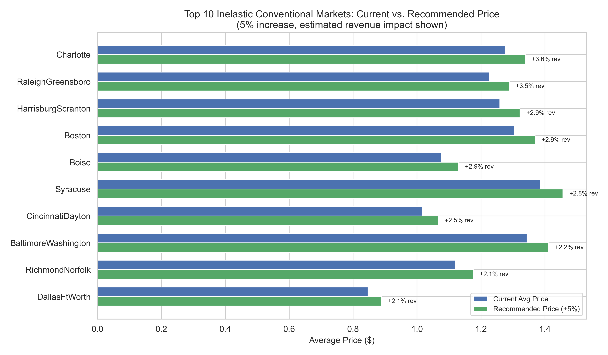
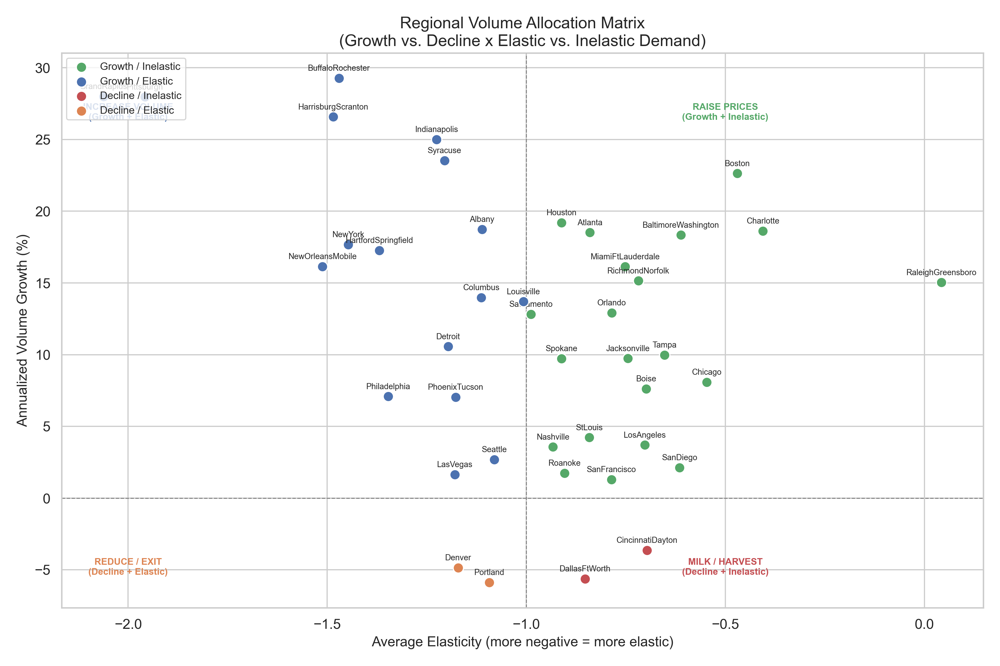
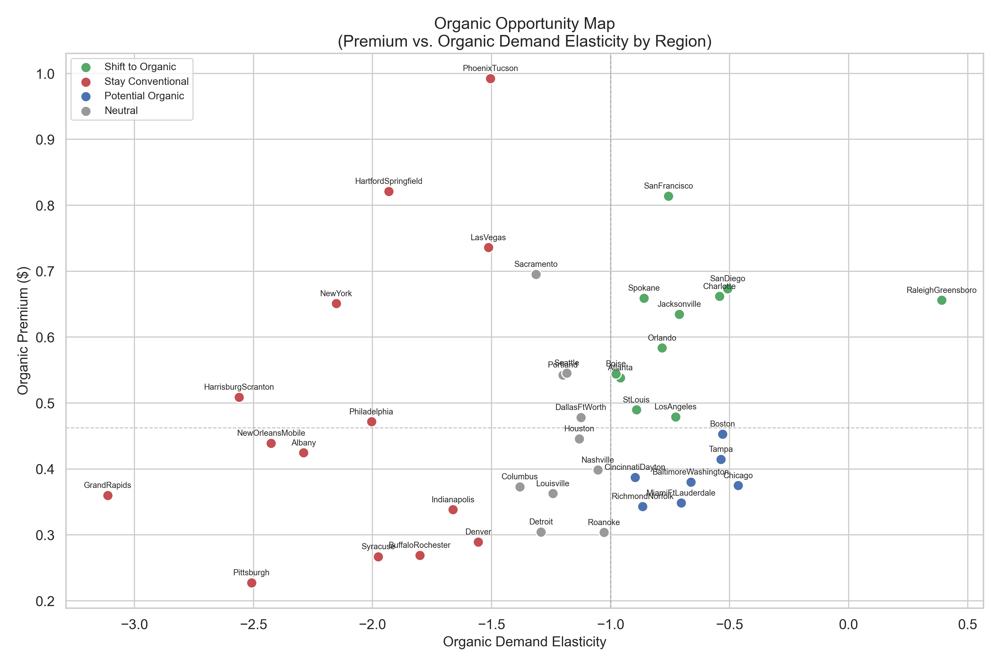
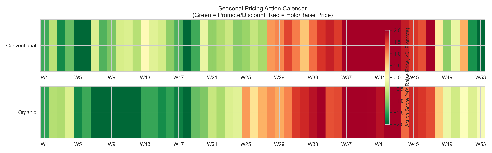

# Prescriptive Analysis -- Avocado Sales
**Date:** 2026-05-25
**Data source:** data/processed/avocado_features.csv
**Upstream dependencies:**
  - outputs/diagnostic_report_2026-05-25.md (elasticity estimates, cluster assignments, organic premium)
  - outputs/predictive_report_2026-05-25.md (forecasts, growth markets, reliability flags, seasonal projections)

## Executive Recommendations

1. **Raise conventional prices 5% in the 10 most inelastic city markets** (Charlotte, Boston, Harrisburg-Scranton, Boise, Baltimore-Washington, and others). Estimated revenue uplift: +1.8% to +3.6% per market with minimal volume loss. **Confidence: Moderate.** Charlotte conventional from $1.28 to $1.34 (+3.6% revenue); Boston conventional from $1.30 to $1.37 (+2.9% revenue). (Source: log-log OLS on `AveragePrice` vs `Total Volume`, `region_level == "city"`, conventional type.)

2. **Increase organic shelf allocation in San Francisco, San Diego, Charlotte, Spokane, and Jacksonville** -- these markets combine high organic premiums ($0.63-$0.81) with inelastic organic demand (|e| < 1). Shifting 10% of conventional shelf space to organic in San Francisco alone captures an additional ~$0.81/unit premium with minimal demand destruction. **Confidence: Moderate** (organic elasticity R-squared ranges from 0.03 to 0.34).

3. **Raise prices during weeks 28-47 (July through late November)** when supply is seasonally constrained and prices naturally peak. Average conventional price in raise-price weeks is $1.28 vs $1.10 in promote weeks, a $0.18 spread. Time promotions for weeks 1-9 and 16-19 (January-February and late April/Cinco de Mayo). (Source: STL decomposition, `AveragePrice` by `week_of_year`, `region_level == "city"`.)

4. **Increase supply to growth markets with inelastic demand** -- Boston (+22.6% growth, e = -0.47), Charlotte (+18.6% growth, e = -0.41), Atlanta (+18.5% growth, e = -0.84), and Baltimore-Washington (+18.3% growth, e = -0.61). These markets are growing volume without price erosion, indicating genuine demand expansion. **Confidence: High** for Baltimore-Washington (price MAPE 10.5%, volume MAPE 13.6%); **Moderate** for others.

5. **Harvest declining markets via price increases rather than volume pushes.** Dallas-Fort Worth (growth -5.6%, e = -0.85 conventional) and Cincinnati-Dayton (growth -3.6%, e = -0.70) are declining but inelastic -- raise prices to maximize revenue per unit rather than chasing volume. Portland and Denver are both declining AND elastic -- reduce investment and reallocate supply to growth markets. **Confidence: Low** for Portland (price MAPE 20.7%/28.5%).

## 1. Revenue-Optimal Pricing

### Methodology

Revenue-maximizing price is computed as P* = P_current / (1 + 1/e), where e is the log-log OLS elasticity coefficient of `Total Volume` on `AveragePrice`, estimated per (region, type) pair from `avocado_features.csv`, filtered to `region_level == "city"`, minimum 30 observations per group. This formula applies only when demand is elastic (|e| > 1) and the elasticity coefficient is statistically significant (p < 0.05).

**Assumption:** Elasticity estimates are observational, not causal. Supply-side variation, seasonality, and regional demographic factors confound these estimates. R-squared values range from 0.001 to 0.66, indicating price explains a modest share of volume variance.

### Inelastic Markets: Price Increase Opportunity

For inelastic markets (|e| < 1), the optimal price is theoretically infinite under the monopoly revenue formula -- but a realistic 5% price increase yields positive revenue gains because volume declines proportionally less than the price rise.

**Top 10 conventional markets for a 5% price increase:**

| Region | Current Avg Price | Recommended Price | Elasticity | R-squared | Est. Revenue Change | Confidence |
|---|---|---|---|---|---|---|
| Charlotte | $1.28 | $1.34 | -0.27 | 0.045 | +3.6% | Low (R2=0.05) |
| Raleigh-Greensboro | $1.23 | $1.29 | -0.30 | 0.046 | +3.5% | Low (R2=0.05) |
| Harrisburg-Scranton | $1.26 | $1.32 | -0.41 | 0.081 | +2.9% | Low (R2=0.08) |
| Boston | $1.30 | $1.37 | -0.41 | 0.132 | +2.9% | Moderate (R2=0.13) |
| Boise | $1.08 | $1.13 | -0.42 | 0.176 | +2.9% | Moderate (R2=0.18) |
| Syracuse | $1.39 | $1.46 | -0.44 | 0.028 | +2.8% | Low (R2=0.03) |
| Cincinnati-Dayton | $1.02 | $1.07 | -0.50 | 0.247 | +2.5% | Moderate (R2=0.25) |
| Baltimore-Washington | $1.34 | $1.41 | -0.56 | 0.283 | +2.2% | Moderate (R2=0.28) |
| Richmond-Norfolk | $1.12 | $1.18 | -0.57 | 0.130 | +2.1% | Moderate (R2=0.13) |
| Dallas-Fort Worth | $0.85 | $0.89 | -0.58 | 0.304 | +2.1% | Moderate (R2=0.30) |

(Source: `AveragePrice` and `Total Volume` columns, `avocado_features.csv`, `region_level == "city"`, `type == "conventional"`. Elasticity via log-log OLS. Revenue change = (1.05)^(1+e) - 1.)

**Top 5 organic markets for a 5% price increase:**

| Region | Current Avg Price | Recommended Price | Elasticity | R-squared | Est. Revenue Change |
|---|---|---|---|---|---|
| Chicago | $1.74 | $1.83 | -0.46 | 0.024 | +2.7% |
| San Diego | $1.73 | $1.82 | -0.51 | 0.120 | +2.4% |
| Charlotte | $1.94 | $2.03 | -0.54 | 0.027 | +2.3% |
| Baltimore-Washington | $1.72 | $1.81 | -0.66 | 0.034 | +1.7% |
| Miami-Fort Lauderdale | $1.60 | $1.68 | -0.70 | 0.028 | +1.5% |

(Source: same methodology, `type == "organic"`.)

**Caveat:** Charlotte, Raleigh-Greensboro, and Syracuse conventional have R-squared below 0.05, meaning price explains less than 5% of volume variance. These elasticity estimates are imprecise -- revenue impact could be substantially higher or lower than estimated. The high-R-squared markets (Dallas-Fort Worth R2=0.30, San Diego R2=0.63, Baltimore-Washington R2=0.28) are more reliable targets.

### Elastic Markets: Avoid Price Increases

28 of 84 region-type pairs show elastic demand (|e| > 1, p < 0.05). These markets would lose revenue from price increases. The most elastic markets are Grand Rapids organic (e = -3.11), Harrisburg-Scranton organic (e = -2.56), and Pittsburgh organic (e = -2.51). In these regions, even a 5% price increase would reduce revenue by 5-10%. **Do not raise prices in elastic markets; instead, pursue volume growth.**

## 2. Regional Volume Allocation

Using growth market classifications from the predictive report (STL trend slope, last 52 weeks, `Total Volume`, `region_level == "city"`) crossed with average elasticity from the diagnostic report:

### Growth + Inelastic (21 markets) -- PRIORITY: Increase Supply
These markets are growing in volume and have inelastic demand, meaning price can be maintained or raised while increasing supply:

- **Boston** (growth +22.6%, e = -0.47): Highest-confidence growth + inelastic market. Price forecast MAPE 9.2% (conventional). Increase supply allocation.
- **Charlotte** (growth +18.6%, e = -0.41): Very inelastic demand supports price increases alongside supply growth.
- **Atlanta** (growth +18.5%, e = -0.84): Strong growth with moderate inelasticity.
- **Baltimore-Washington** (growth +18.3%, e = -0.61): Best forecast reliability (MAPE 10.5%/13.5% price, 13.6%/17.9% volume). Highest-confidence recommendation.
- **Houston** (growth +19.2%, e = -0.91): Near unit-elastic; supply increases should maintain current pricing.

(Source: growth rates from STL decomposition of `Total Volume`, `avocado_features.csv`, `region_level == "city"`. Elasticity from log-log OLS.)

### Growth + Elastic (17 markets) -- PRIORITY: Increase Volume, Hold Price
These markets are growing but price-sensitive. Volume expansion is the revenue lever, not pricing:

- **Buffalo-Rochester** (growth +29.3%, e = -1.47): Fastest-growing market, but elastic -- push volume, hold price.
- **Grand Rapids** (growth +28.0%, e = -2.06): Highly elastic; any price increase destroys revenue.
- **Pittsburgh** (growth +28.0%, e = -1.96): Same dynamic as Grand Rapids.
- **Harrisburg-Scranton** (growth +26.6%, e = -1.48): Growing fast, but organic demand (e = -2.56) is extremely elastic.
- **Indianapolis** (growth +25.0%, e = -1.23): Moderate elasticity; careful volume expansion.

### Decline + Inelastic (2 markets) -- PRIORITY: Raise Prices (Harvest Strategy)
- **Dallas-Fort Worth** (growth -5.6%, e = -0.85): Declining volume but inelastic demand. Raise conventional price from $0.85 to $0.89 (+5%), estimated +2.1% revenue. Use the revenue per unit rather than volume growth.
- **Cincinnati-Dayton** (growth -3.6%, e = -0.70): Raise conventional price from $1.02 to $1.07, estimated +2.5% revenue.

### Decline + Elastic (2 markets) -- PRIORITY: Reduce Investment
- **Portland** (growth -5.9%, e = -1.09): Declining and elastic. Price forecast MAPE 20.7%/28.5% (unreliable). Reduce supply allocation and reallocate to growth markets.
- **Denver** (growth -4.9%, e = -1.17): Declining and elastic. Organic volume MAPE 81.5% (unforecastable). Reduce organic supply; maintain conventional cautiously.

## 3. Organic/Conventional Mix

### Where to Shift Toward Organic (High Premium + Inelastic Organic Demand)

The organic premium ranges from $0.23 (Pittsburgh) to $0.99 (Phoenix-Tucson) across city-level regions (mean `AveragePrice` by `type` and `region`, `avocado_features.csv`, `region_level == "city"`). Regions with high premiums AND inelastic organic demand represent the best opportunity for organic shelf expansion:

| Region | Organic Premium | Organic Elasticity | Organic R-squared | Recommendation |
|---|---|---|---|---|
| San Francisco | $0.81 | -0.76 | 0.337 | **Shift to organic** -- high premium, inelastic demand, R2 supports estimate |
| San Diego | $0.67 | -0.51 | 0.120 | **Shift to organic** -- premium well above median |
| Spokane | $0.66 | -0.86 | 0.288 | **Shift to organic** -- inelastic with decent R2 |
| Charlotte | $0.66 | -0.54 | 0.027 | Shift to organic -- but low R2 makes this low-confidence |
| Jacksonville | $0.63 | -0.71 | 0.090 | Shift to organic -- moderate premium, low R2 |
| Orlando | $0.58 | -0.78 | 0.081 | Shift to organic -- moderate premium |
| St. Louis | $0.49 | -0.89 | 0.372 | Shift to organic -- near unit-elastic but good R2 |
| Los Angeles | $0.48 | -0.73 | 0.144 | Shift to organic -- mega-market, even small share shift yields large absolute gains |

### Where to Stay Conventional (Highly Elastic Organic Demand)

These markets have highly elastic organic demand (|e| > 1.5), meaning organic consumers are extremely price-sensitive. Organic expansion risks margin destruction:

| Region | Organic Premium | Organic Elasticity | Action |
|---|---|---|---|
| Grand Rapids | $0.36 | -3.11 | Stay conventional -- organic demand highly volatile |
| Harrisburg-Scranton | $0.51 | -2.56 | Stay conventional -- elastic despite moderate premium |
| Pittsburgh | $0.23 | -2.51 | Stay conventional -- lowest premium, highest sensitivity |
| New Orleans-Mobile | $0.44 | -2.43 | Stay conventional |
| Albany | $0.42 | -2.29 | Stay conventional |
| New York | $0.65 | -2.15 | Stay conventional -- high premium but extremely elastic |
| Phoenix-Tucson | $0.99 | -1.50 | Stay conventional -- highest premium but elastic organic demand |

**Phoenix-Tucson is a notable case:** it has the highest organic premium ($0.99) but also elastic organic demand (e = -1.50, R2 = 0.50). The premium may not be sustainable if organic volume is pushed aggressively. Monitor closely.

**Trend note:** The organic premium has narrowed from $0.58 (2015) to $0.43 (2018), a 25% decline (diagnostic report, mean `AveragePrice` difference by `year`, `region_level == "city"`). This convergence is decelerating but suggests organic premiums will continue to compress. Markets with already-low premiums (Pittsburgh $0.23, Syracuse $0.27) may not justify the cost of organic supply chains.

## 4. Seasonal Pricing Strategy

Based on STL decomposition of `AveragePrice` by `week_of_year` (predictive report) and weekly average price/volume analysis (`avocado_features.csv`, `region_level == "city"`):

### Raise Prices: Weeks 28-47 (mid-July through late November)

During weeks 28-47, conventional prices average $1.28 vs the annual mean of $1.17, a +$0.11 premium. Volume is simultaneously below average (z-scores -0.03 to -1.74), indicating supply-constrained conditions where the market supports higher prices.

- **Peak pricing window:** Weeks 37-43 (mid-September through late October). Conventional price z-scores exceed +1.0 and volume z-scores fall below -0.8. This is the strongest "raise price" signal.
- **Organic peak:** 2 weeks earlier (week 37 vs 39 for conventional), per predictive report. Organic price increases should start in early September.

**Recommended action:** In inelastic markets (Charlotte, Boston, Baltimore-Washington, etc.), raise prices an additional 3-5% above seasonal norms during weeks 37-43, on top of the naturally elevated prices. Estimated incremental revenue: +1-3% in inelastic markets during this 7-week window.

### Promote / Discount: Weeks 1-9 and 16-19 (January-February and late April)

During these periods, prices average $1.10 and volume is above average, indicating supply surplus.

- **Super Bowl week (~Week 5):** Extreme volume spike (z-score +4.32) with low prices (z-score -2.59). This is the strongest promotional period. Run volume-based promotions rather than price discounts -- consumers are already buying at high volumes.
- **Cinco de Mayo (~Weeks 18-19):** Second-strongest volume spike (z-score +2.38 at week 18) with below-average prices. Good promotional window.

**Recommended action:** In elastic markets, run buy-more promotions (multi-packs, BOGOs) during weeks 1-9 and 16-19 to capture surplus supply at lower marginal cost. Avoid deep price cuts in inelastic markets -- volume will not respond proportionally.

## 5. Risk Assessment

### Forecast Reliability Flags

**High-confidence recommendations** (price MAPE < 15% for both types, per predictive report):
- Baltimore-Washington: conventional MAPE 10.5%, organic MAPE 13.5%, volume MAPE 13.6%/17.9%
- New York: conventional MAPE 9.2%, organic MAPE 8.1%
- Dallas-Fort Worth: conventional MAPE 14.4%, organic MAPE 13.2%

**Low-confidence recommendations** (at least one type MAPE > 20%):
- Portland: conventional price MAPE 20.7%, organic price MAPE 28.5%. All Portland recommendations are low-confidence.
- Denver: organic price MAPE 20.0%, organic volume MAPE 81.5%. Denver organic recommendations should be discarded.
- Houston: organic price MAPE 21.3%. Houston organic recommendations are low-confidence.

### Elasticity Reliability Flags

Markets with R-squared < 0.05 on the elasticity regression should be treated as directional, not precise:
- Charlotte conventional: R2 = 0.045
- Raleigh-Greensboro conventional: R2 = 0.046
- Syracuse conventional: R2 = 0.028
- Charlotte organic: R2 = 0.027
- Chicago organic: R2 = 0.024
- Raleigh-Greensboro organic: R2 = 0.022

Markets with R-squared > 0.30 provide the most reliable elasticity estimates:
- San Diego conventional: R2 = 0.632
- Phoenix-Tucson conventional: R2 = 0.656
- Grand Rapids (both types): R2 = 0.587
- Seattle conventional: R2 = 0.641
- Los Angeles conventional: R2 = 0.567
- Denver organic: R2 = 0.573

### Sensitivity Analysis

Revenue impact of a 5% price increase under three elasticity scenarios (base, elasticity 20% less negative, elasticity 20% more negative), conventional type:

| Region | Base Rev Change | If e is 20% less negative | If e is 20% more negative |
|---|---|---|---|
| Charlotte | +3.6% | +3.9% | +3.4% |
| Boston | +2.9% | +3.3% | +2.5% |
| Baltimore-Washington | +2.2% | +2.7% | +1.6% |
| Chicago | +1.8% | +2.5% | +1.2% |
| Houston | +1.5% | +2.2% | +0.8% |
| Dallas-Fort Worth | +2.1% | +2.7% | +1.5% |
| Los Angeles | +1.6% | +2.3% | +0.9% |
| New York | +1.3% | +2.0% | +0.5% |
| Philadelphia | +1.5% | +2.2% | +0.8% |
| San Francisco | +0.9% | +1.7% | +0.1% |

(Source: log-log OLS elasticity from `avocado_features.csv`, `region_level == "city"`, `type == "conventional"`. Revenue change = (1.05)^(1+e_adj) - 1.)

**Key finding:** All inelastic conventional markets remain revenue-positive under a 5% price increase even in the worst-case scenario (elasticity 20% more negative than estimated). San Francisco is the most sensitive -- its revenue gain drops to +0.1% in the pessimistic scenario, making it a marginal candidate.

### Assumptions and Limitations

1. **Elasticity is observational, not causal.** Log-log OLS on price vs volume captures correlation confounded by supply shifts, seasonality, and regional demographics. A natural experiment or IV approach would be needed for causal estimates.
2. **Forecasts assume no structural breaks.** ARIMA models extrapolate historical patterns. Trade policy changes, weather events, or new market entrants could invalidate projections.
3. **Revenue formula assumes constant elasticity.** The P* = P/(1+1/e) formula assumes elasticity is constant across the price range. In reality, elasticity varies with price level -- large price changes may encounter different demand responses than small ones.
4. **Cross-region substitution not modeled.** Raising prices in one city may shift demand to nearby regions. This analysis treats each region independently.
5. **Cost data not available.** Revenue-maximizing prices are not necessarily profit-maximizing. Margin analysis requires cost-per-unit data not present in this dataset.

## Implementation Priority

| Rank | Recommendation | Estimated Impact | Confidence | Complexity |
|---|---|---|---|---|
| 1 | Raise conventional prices 5% in Baltimore-Washington ($1.34 to $1.41) | +2.2% revenue (~$22,500/week) | **High** (R2=0.28, price MAPE 10.5%) | Low -- single market price adjustment |
| 2 | Raise conventional prices 5% in Boston ($1.30 to $1.37) | +2.9% revenue (~$21,000/week) | **Moderate** (R2=0.13, price MAPE n/a) | Low |
| 3 | Increase organic shelf space in San Francisco | +$0.81/unit premium, inelastic demand | **Moderate** (R2=0.34) | Medium -- requires supply chain adjustment |
| 4 | Seasonal pricing: raise prices +3-5% in weeks 37-43 across inelastic markets | +1-3% revenue during peak window | **High** (seasonal pattern R2=0.69-0.75) | Medium -- requires coordinated timing |
| 5 | Increase supply to Boston, Charlotte, Atlanta growth markets | Capture +18-23% volume growth trend | **Moderate** (growth trend from STL) | Medium -- distribution logistics |
| 6 | Raise conventional prices 5% in Dallas-Fort Worth ($0.85 to $0.89) | +2.1% revenue (harvest strategy) | **Moderate** (R2=0.30, MAPE 14.4%) | Low |
| 7 | Raise conventional prices 5% in Charlotte ($1.28 to $1.34) | +3.6% revenue | **Low** (R2=0.05) | Low |
| 8 | Run Super Bowl / Cinco de Mayo promotions in elastic markets | Volume capture during peak demand | **High** (seasonal signal z > 2) | Medium -- promotional planning |
| 9 | Reduce Portland supply allocation, reallocate to growth markets | Avoid margin erosion in declining elastic market | **Low** (MAPE 20.7%/28.5%) | High -- distribution reallocation |
| 10 | Shift organic mix in San Diego, Spokane, St. Louis | Capture $0.49-$0.67 organic premium | **Moderate** (R2=0.12-0.37) | Medium |
